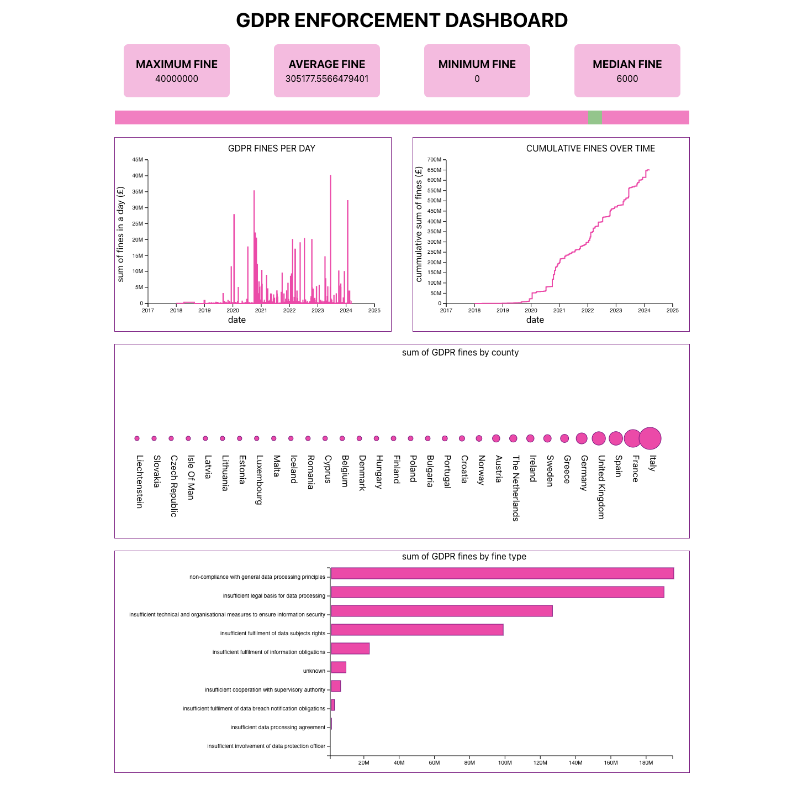

# gdpr-enforcement-analytics

Data is scraped from https://www.enforcementtracker.com/



# installation

## python

1. pull the repo
2. cd into the repo
3. create a python virtual environment
4. activate the environment and install python dependencies found in requirements.txt

## react

1. cd into dashboard
2. run `npm i`

# running the project

## scraper

1. activate the python environment
2. cd into etl
3. run `python crawler.py` (Note: ensure you have setup your datasabse and put credential in `cleaner.py`)
4. run `python cleaner.py`

## api

1. activate the python virtual environment
2. cd into api
3. run `uvicorn main:app` in a new terminal window

## dashboard

1. cd into dashboard in a new terminal
2. run `npm install`
3. run `npm start` 

creating the table in the db
```
create table clean_gdpr (
	etid VARCHAR,
	country VARCHAR,
	date_of_decision DATE,
	fine VARCHAR,
	controller_or_processor VARCHAR,
	quoted_art VARCHAR,
	fine_type VARCHAR
);
```

creating user 
```
create user gdpr with password 'gdpr';
grant all PRIVILEGES ON ALL TABLES IN SCHEMA public to gdpr;
```

make the user an owner
```
ALTER TABLE clean_gdpr OWNER TO gdpr;
```
